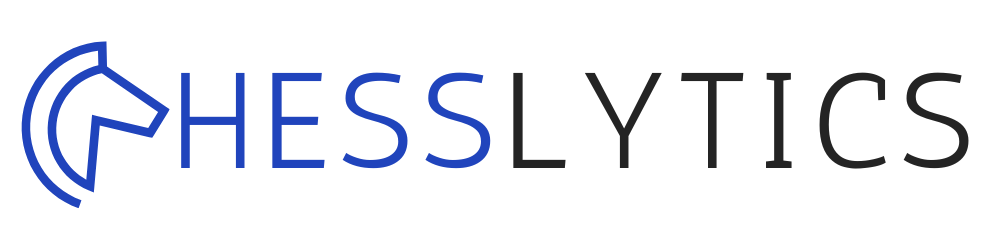

# Chesslytics: AI-Powered Chess Analysis Platform

<a id="readme-top"></a>



**Chesslytics** is a cutting-edge mobile application that revolutionizes chess analysis through AI-powered move evaluation, engine-assisted strategy, and comprehensive game review. Built with React Native and Expo, Chesslytics provides chess enthusiasts with professional-grade analysis tools in a user-friendly mobile interface.

<!-- TABLE OF CONTENTS -->
<details>
  <summary>Table of Contents</summary>
  <ol>
    <li>
      <a href="#about-the-project">About The Project</a>
      <ul>
        <li><a href="#key-features">Key Features</a></li>
        <li><a href="#analysis-categories">Analysis Categories</a></li>
        <li><a href="#built-with">Built With</a></li>
      </ul>
    </li>
    <li>
      <a href="#getting-started">Getting Started</a>
      <ul>
        <li><a href="#prerequisites">Prerequisites</a></li>
        <li><a href="#installation">Installation</a></li>
      </ul>
    </li>
    <li><a href="#usage">Usage</a></li>
    <li><a href="#architecture">Architecture</a></li>
    <li><a href="#roadmap">Roadmap</a></li>
    <li><a href="#contributing">Contributing</a></li>
    <li><a href="#license">License</a></li>
    <li><a href="#contact">Contact</a></li>
    <li><a href="#acknowledgments">Acknowledgments</a></li>
  </ol>
</details>

<!-- ABOUT THE PROJECT -->

## About The Project

**Chesslytics** transforms how chess players analyze their games by combining the power of Stockfish engine analysis with AI-generated insights. Whether you're a beginner looking to improve or an advanced player refining your strategy, Chesslytics provides the tools to understand your strengths, identify weaknesses, and elevate your game.

### Key Features

✅ **AI-Powered Move Analysis** - Natural language explanations for optimal moves using Cerebras AI integration

✅ **Stockfish Engine Integration** - Professional-grade chess analysis with centipawn evaluations and multi-line suggestions

✅ **Comprehensive Game Review** - Accuracy percentage calculation with detailed move statistics for both players

✅ **Interactive Chessboard** - Full PGN support with move-by-move navigation and position analysis

✅ **Personal Game Library** - Import, organize, and analyze your chess games with cloud synchronization

✅ **Real-time Position Evaluation** - Instant feedback on move quality with visual indicators

✅ **Cross-platform Mobile App** - Seamless experience on both iOS and Android devices

### Analysis Categories

Chesslytics categorizes moves based on their quality and impact:

| Category       | Description                                      | Accuracy Weight |
| -------------- | ------------------------------------------------ | --------------- |
| **Brilliant**  | Exceptional move with significant advantage gain | 100%            |
| **Best**       | Optimal move according to engine analysis        | 100%            |
| **Good**       | Solid move with minor inaccuracies               | 90%             |
| **Inaccuracy** | Suboptimal move that loses some advantage        | 50%             |
| **Mistake**    | Significant error that changes evaluation        | 30%             |
| **Blunder**    | Critical error that loses material or game       | 0%              |

### Built With

This project leverages a powerful technology stack combining modern mobile development with advanced chess analysis:

#### Mobile Framework

- [![React Native][ReactNative]][ReactNative-url]
- [![Expo][Expo]][Expo-url]
- [![TypeScript][TypeScript]][TypeScript-url]

#### Chess Analysis

- [![Stockfish][Stockfish]][Stockfish-url]
- [![chess.js][Chess.js]][Chess.js-url]
- [![Cerebras AI][Cerebras]][Cerebras-url]

#### State Management & Data

- [![Zustand][Zustand]][Zustand-url]
- [![Supabase][Supabase]][Supabase-url]
- [![AsyncStorage][AsyncStorage]][AsyncStorage-url]

#### UI Components

- [![React Navigation][ReactNavigation]][ReactNavigation-url]
- [![Phosphor Icons][Phosphor]][Phosphor-url]
- [![React Native Reanimated][Reanimated]][Reanimated-url]

<p align="right">(<a href="#readme-top">back to top</a>)</p>

<!-- GETTING STARTED -->

## Getting Started

Get a local copy up and running with these simple steps.

### Prerequisites

Ensure you have the following installed:

- Node.js (v18+ recommended)
- npm or yarn
- Expo CLI
- Cerebras AI API key (for AI analysis features)

### Installation

1. **Clone the repository**

   ```sh
   git clone https://github.com/rishikanchi/Chesslytics.git
   cd Chesslytics
   ```

2. **Install dependencies**

   ```sh
   npm install
   # or
   yarn install
   ```

3. **Set up environment variables**

   Create a `.env` file in the root directory:

   ```env
   EXPO_PUBLIC_CEREBRAS_API_KEY=your_api_key_here
   ```

4. **Start the development server**

   ```sh
   npx expo start
   ```

5. **Run the app**

   - Press `i` to open iOS simulator
   - Press `a` to open Android emulator
   - Scan the QR code with Expo Go app on your physical device

<p align="right">(<a href="#readme-top">back to top</a>)</p>

<!-- USAGE EXAMPLES -->

## Usage

### Basic Workflow

1. **Sign Up / Log In**

   - Create an account or log in to existing one
   - Authentication state persists across sessions

2. **Import Your Games**

   - Add games via PGN (Portable Game Notation)
   - Games are automatically parsed and stored in your library
   - Each game includes metadata: date, players, time control, result

3. **Analyze Move by Move**

   - Navigate through moves using the interactive chessboard
   - View real-time Stockfish evaluation for each position
   - See AI-generated explanations for suggested improvements

4. **Review Game Performance**

   - Access comprehensive accuracy statistics
   - Compare performance between players
   - Identify patterns in your play style

5. **Explore Engine Suggestions**
   - View top engine-recommended moves
   - Analyze alternative lines and variations
   - Understand positional advantages

### Advanced Features

- **Multi-game Analysis**: Compare performance across multiple games
- **Opening Theory**: Identify opening choices and their success rates
- **Endgame Practice**: Focus on specific game phases
- **Player Profiles**: Track improvement over time
- **Export Functionality**: Share analysis with coaches or friends

### Example PGN Input

```
[Event "Rated Classical game"]
[Site "https://lichess.org/abc123"]
[Date "2023.01.15"]
[White "Player1"]
[Black "Player2"]
[Result "1-0"]
[TimeControl "45+5"]

1. e4 e5 2. Nf3 Nc6 3. Bb5 a6 4. Ba4 Nf6 5. O-O Be7 6. Re1 b5 7. Bb3 d6 8. c3 O-O 9. h3 Nb8 10. d4 Nbd7 11. Nbd2 Bb7 12. Bc2 Re8 13. Nf1 Bf8 14. Ng3 g6 15. a4 c5 16. d5 c4 17. Bg5 h6 18. Bh4 g5 19. Bg3 Nh5 20. Nh2 Qc7 21. f4 gxf4 22. Rxf4 Ng6 23. Rf2 Kh7 24. Nf3 Nf6 25. Qd2 Ng7 26. Nh4 Nxh4 27. Bxh4 f5 28. exf5 Rxf5 29. Rxf5 Bxf5 30. Nf4 Bg6 31. Ne6 Qd7 32. Nxg7 Kxg7 33. Qf4 Rf8 34. Qxf8+ Kxf8 35. Rf1+ Ke8 36. Bg6+ Kd8 37. Bf7 Qe7 38. Bxe7+ Kxe7 39. Rf7+ Kd8 40. Rxb7 1-0
```

<p align="right">(<a href="#readme-top">back to top</a>)</p>

<!-- ARCHITECTURE -->

## Architecture

### System Overview

```
┌───────────────────────────────────────────────────────────────┐
│                        Chesslytics Platform                     │
├─────────────────┬─────────────────┬─────────────────┬─────────────┤
│   Frontend      │    Backend      │   Chess Engine  │   Database   │
│                 │                 │   & AI          │              │
├─────────────────┼─────────────────┼─────────────────┼─────────────┤
│ React Native    │ Supabase Auth   │ Stockfish       │ Supabase     │
│ Expo Framework  │ REST API        │ Cerebras AI     │ PostgreSQL   │
│ Zustand State   │ User Mgmt       │ PyTorch Models  │ Storage      │
│ Chessboard UI   │ Game Storage    │ Move Analysis   │ Analytics    │
└─────────────────┴─────────────────┴─────────────────┴─────────────┘
```

### Data Flow

```
1. User Action → 2. React Native UI → 3. Zustand State Update
                      ↓
                  4. Supabase API → 5. Chess Engine Analysis
                      ↓
                  6. AI Processing → 7. Data Visualization
```

### Component Diagram

```
[Mobile App] ←→ [Supabase] ←→ [Stockfish Engine]
       ↓
[Chessboard] ←→ [Cerebras AI] ←→ [Analysis Results]
```

<p align="right">(<a href="#readme-top">back to top</a>)</p>

<!-- ROADMAP -->

## Roadmap

- [x] Core chessboard implementation
- [x] PGN parsing and game import
- [x] Stockfish engine integration
- [x] Move-by-move analysis
- [x] Accuracy calculation system
- [x] User authentication
- [x] Game library management
- [x] AI-powered move explanations
- [ ] Advanced opening theory database
- [ ] Endgame tablebase integration
- [ ] Multi-game comparison tools
- [ ] Coach/player collaboration features
- [ ] Video analysis with move overlay
- [ ] Tournament preparation tools
- [ ] Custom training regimens
- [ ] Social features (game sharing, challenges)
- [ ] Desktop application version
- [ ] Web platform expansion
- [ ] Advanced analytics dashboard
- [ ] Machine learning-based player profiling

<p align="right">(<a href="#readme-top">back to top</a>)</p>

<!-- CONTRIBUTING -->

## Contributing

Contributions are what make the open source community such an amazing place to learn, inspire, and create. Any contributions you make are **greatly appreciated**.

### How to Contribute

1. **Fork the Project**
2. **Create your Feature Branch**
   ```sh
   git checkout -b feature/AmazingFeature
   ```
3. **Commit your Changes**
   ```sh
   git commit -m 'Add some AmazingFeature'
   ```
4. **Push to the Branch**
   ```sh
   git push origin feature/AmazingFeature
   ```
5. **Open a Pull Request**

### Development Guidelines

- Follow existing code style and patterns
- Use TypeScript types for all functions and components
- Write comprehensive tests for new features
- Update documentation for changes
- Keep pull requests focused and atomic
- Include screenshots for UI changes

### Code Style Guidelines

```typescript
// Good: TypeScript with clear interfaces
export interface GameData {
  id: string;
  title: string;
  date: string;
  playerColor: "white" | "black";
  winner: "white" | "black" | "draw";
  timeControl: string;
  accuracy: number;
  pgn: string;
}

// Good: Zustand state management
export const useStore = create<Store>((set, get) => ({
  games: null,
  currentGameIndex: null,
  setCurrentGameIndex: (index) => set({ currentGameIndex: index }),
  // ... other state management
}));

// Good: React Native component with proper typing
const MyChessBoard = () => {
  const [positions, setPositions] = useState<string[]>([]);
  const setCurrentFen = useStore((state) => state.setCurrentFen);

  // Component logic...
  return <Chessboard fen={currentFen} />;
};
```

### Code of Conduct

- Be respectful and inclusive
- Provide constructive feedback
- Follow GitHub community guidelines
- Maintain professional communication
- Focus on chess improvement and education

<p align="right">(<a href="#readme-top">back to top</a>)</p>

<!-- LICENSE -->

## License

Distributed under the MIT License. See `LICENSE` for more information.

<p align="right">(<a href="#readme-top">back to top</a>)</p>

<!-- CONTACT -->

## Contact

Rishi Kanchi - me [at] rishikanchi [dot] com

Project Link: [https://github.com/rishikanchi/Chesslytics](https://github.com/rishikanchi/Chesslytics)

<p align="right">(<a href="#readme-top">back to top</a>)</p>

<!-- ACKNOWLEDGMENTS -->

## Acknowledgments

This project wouldn't be possible without these amazing resources and technologies:

- [Expo](https://expo.dev/) - For providing the amazing development platform
- [Stockfish](https://stockfishchess.org/) - Powerful chess engine for analysis
- [Cerebras AI](https://www.cerebras.ai/) - AI analysis capabilities
- [chess.js](https://github.com/jhlywa/chess.js) - Chess logic implementation
- [React Native Chessboard](https://github.com/ShahinMorshed/react-native-chessboard) - Chessboard UI component
- [Zustand](https://github.com/pmndrs/zustand) - Lightweight state management
- [Supabase](https://supabase.com/) - Open-source Firebase alternative
- [Phosphor Icons](https://phosphoricons.com/) - Beautiful icon set
- [React Navigation](https://reactnavigation.org/) - Navigation solution
- [React Native Reanimated](https://docs.swmansion.com/react-native-reanimated/) - Smooth animations

<p align="right">(<a href="#readme-top">back to top</a>)</p>

<!-- MARKDOWN LINKS & IMAGES -->
<!-- https://www.markdownguide.org/basic-syntax/#reference-style-links -->

[contributors-shield]: https://img.shields.io/github/contributors/rishikanchi/Chesslytics.svg?style=for-the-badge
[contributors-url]: https://github.com/rishikanchi/Chesslytics/graphs/contributors
[forks-shield]: https://img.shields.io/github/forks/rishikanchi/Chesslytics.svg?style=for-the-badge
[forks-url]: https://github.com/rishikanchi/Chesslytics/network/members
[stars-shield]: https://img.shields.io/github/stars/rishikanchi/Chesslytics.svg?style=for-the-badge
[stars-url]: https://github.com/rishikanchi/Chesslytics/stargazers
[issues-shield]: https://img.shields.io/github/issues/rishikanchi/Chesslytics.svg?style=for-the-badge
[issues-url]: https://github.com/rishikanchi/Chesslytics/issues
[license-shield]: https://img.shields.io/github/license/rishikanchi/Chesslytics.svg?style=for-the-badge
[license-url]: https://github.com/rishikanchi/Chesslytics/blob/master/LICENSE

<!-- Technology Stack Badges -->

[ReactNative]: https://img.shields.io/badge/React_Native-20232A?style=for-the-badge&logo=react&logoColor=61DAFB
[ReactNative-url]: https://reactnative.dev/
[Expo]: https://img.shields.io/badge/Expo-000020?style=for-the-badge&logo=expo&logoColor=white
[Expo-url]: https://expo.dev/
[TypeScript]: https://img.shields.io/badge/TypeScript-007ACC?style=for-the-badge&logo=typescript&logoColor=white
[TypeScript-url]: https://www.typescriptlang.org/
[Stockfish]: https://img.shields.io/badge/Stockfish-00BCD4?style=for-the-badge&logo=chess&logoColor=white
[Stockfish-url]: https://stockfishchess.org/
[Chess.js]: https://img.shields.io/badge/chess.js-F7DF1E?style=for-the-badge&logo=javascript&logoColor=black
[Chess.js-url]: https://github.com/jhlywa/chess.js
[Cerebras]: https://img.shields.io/badge/Cerebras_AI-00D4AA?style=for-the-badge&logo=ai&logoColor=white
[Cerebras-url]: https://www.cerebras.ai/
[Zustand]: https://img.shields.io/badge/Zustand-3E67B1?style=for-the-badge&logo=zustand&logoColor=white
[Zustand-url]: https://github.com/pmndrs/zustand
[Supabase]: https://img.shields.io/badge/Supabase-3ECF8E?style=for-the-badge&logo=supabase&logoColor=white
[Supabase-url]: https://supabase.com/
[AsyncStorage]: https://img.shields.io/badge/AsyncStorage-61DAFB?style=for-the-badge&logo=react&logoColor=black
[AsyncStorage-url]: https://react-native-async-storage.github.io/async-storage/
[ReactNavigation]: https://img.shields.io/badge/React_Navigation-7B42BC?style=for-the-badge&logo=react&logoColor=white
[ReactNavigation-url]: https://reactnavigation.org/
[Phosphor]: https://img.shields.io/badge/Phosphor_icons-4A4A4A?style=for-the-badge&logo=phosphor&logoColor=white
[Phosphor-url]: https://phosphoricons.com/
[Reanimated]: https://img.shields.io/badge/Reanimated-FF6B6B?style=for-the-badge&logo=react&logoColor=white
[Reanimated-url]: https://docs.swmansion.com/react-native-reanimated/

---

**Elevate your chess game with Chesslytics - where every move tells a story!** 🏁
